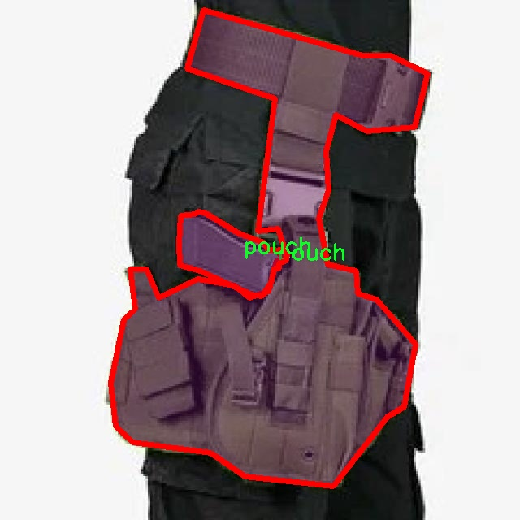

# 武器检测与分割系统源码＆数据集分享
 [yolov8-seg-SPPF-LSKA＆yolov8-seg-FocalModulation等50+全套改进创新点发刊_一键训练教程_Web前端展示]

### 1.研究背景与意义

项目参考[ILSVRC ImageNet Large Scale Visual Recognition Challenge](https://gitee.com/YOLOv8_YOLOv11_Segmentation_Studio/projects)

项目来源[AAAI Global Al lnnovation Contest](https://kdocs.cn/l/cszuIiCKVNis)

研究背景与意义

随着科技的迅猛发展，计算机视觉技术在各个领域的应用日益广泛，尤其是在安全监控、公共安全和军事领域，武器检测与分割系统的研究显得尤为重要。传统的武器检测方法多依赖于人工监控和简单的图像处理技术，效率低下且容易受到人为因素的影响。近年来，深度学习技术的快速发展为武器检测提供了新的解决方案，尤其是基于卷积神经网络（CNN）的目标检测算法，如YOLO（You Only Look Once）系列，因其高效性和实时性而受到广泛关注。

YOLOv8作为YOLO系列的最新版本，结合了多种先进的深度学习技术，具有更高的检测精度和更快的处理速度。然而，现有的YOLOv8模型在特定场景下的武器检测和分割能力仍有待提升，尤其是在复杂背景、不同光照条件以及多种武器类型的情况下。因此，基于改进YOLOv8的武器检测与分割系统的研究具有重要的现实意义。

本研究将采用一个包含1600张图像的专用数据集，该数据集涵盖了9个类别，包括“人”、“枪支”、“长武器”、“短武器”等。这些类别的划分不仅有助于提高模型的分类精度，也为后续的实例分割提供了基础。通过对数据集的深入分析，我们可以发现不同类别之间的特征差异，从而为模型的改进提供数据支持。此外，数据集中“人”和“武器”类的结合，使得模型能够在复杂场景中有效区分持有武器的人与不持有武器的人，这对于公共安全监控系统的实时响应至关重要。

在研究过程中，我们将对YOLOv8模型进行多方面的改进，包括网络结构的优化、数据增强技术的应用以及损失函数的调整等。通过这些改进，我们期望提升模型在武器检测和分割任务中的表现，尤其是在精度和召回率方面。同时，研究还将探讨如何利用迁移学习和自监督学习等技术，进一步提升模型在小样本数据集上的泛化能力。

本研究的意义不仅在于技术层面的突破，更在于其对社会安全的贡献。随着全球安全形势的日益复杂，武器检测与分割系统的有效性直接关系到公共安全和社会稳定。通过实现高效、准确的武器检测与分割，我们能够在潜在威胁发生之前，及时识别并采取相应措施，从而有效降低安全风险。此外，研究成果还可为其他领域的目标检测与分割提供借鉴，推动计算机视觉技术的进一步发展。

综上所述，基于改进YOLOv8的武器检测与分割系统的研究，既是对现有技术的创新与完善，也是对社会安全需求的积极响应。通过本研究，我们希望能够为武器检测领域提供一种高效、准确的解决方案，为维护公共安全贡献一份力量。

### 2.图片演示


##### 注意：由于此博客编辑较早，上面“2.图片演示”和“3.视频演示”展示的系统图片或者视频可能为老版本，新版本在老版本的基础上升级如下：（实际效果以升级的新版本为准）

  （1）适配了YOLOV8的“目标检测”模型和“实例分割”模型，通过加载相应的权重（.pt）文件即可自适应加载模型。

  （2）支持“图片识别”、“视频识别”、“摄像头实时识别”三种识别模式。

  （3）支持“图片识别”、“视频识别”、“摄像头实时识别”三种识别结果保存导出，解决手动导出（容易卡顿出现爆内存）存在的问题，识别完自动保存结果并导出到tempDir中。

  （4）支持Web前端系统中的标题、背景图等自定义修改，后面提供修改教程。

  另外本项目提供训练的数据集和训练教程,暂不提供权重文件（best.pt）,需要您按照教程进行训练后实现图片演示和Web前端界面演示的效果。

### 3.视频演示

[3.1 视频演示](https://www.bilibili.com/video/BV1YbStYhEgY/)

### 4.数据集信息展示

##### 4.1 本项目数据集详细数据（类别数＆类别名）

nc: 8
names: ['cabura', 'guns', 'long_weapons', 'man_with_weapon', 'man_without_weapon', 'person', 'pouch', 'short_weapons']


##### 4.2 本项目数据集信息介绍

数据集信息展示

在本研究中，我们使用了名为“guns”的数据集，以训练和改进YOLOv8-seg的武器检测与分割系统。该数据集专注于武器相关的目标检测与分割任务，具有广泛的应用潜力，尤其是在安全监控、公共场所安保及执法等领域。数据集包含8个类别，具体类别包括：cabura、guns、long_weapons、man_with_weapon、man_without_weapon、person、pouch和short_weapons。这些类别的选择反映了武器检测任务的复杂性和多样性，涵盖了从武器本身到携带武器的人的多种情况。

首先，数据集中的“cabura”类别主要指代一种特定类型的武器，可能是指某种传统或现代的枪械。该类别的存在为模型提供了识别特定武器的能力，帮助系统在复杂场景中更准确地定位和分类武器。接下来的“guns”类别则是一个更为广泛的分类，涵盖了所有类型的枪械，进一步增强了模型对武器的整体识别能力。

“long_weapons”类别专注于长武器的检测，如步枪和长枪等，这些武器通常在特定场合下被使用，具有较高的威胁性。相对而言，“short_weapons”类别则包括手枪和其他短武器，这类武器在日常生活中更为常见，因此其检测的准确性对提升公共安全至关重要。

在与人相关的类别中，“man_with_weapon”与“man_without_weapon”分别表示携带武器的男性和不携带武器的男性。这两个类别的设置使得模型能够在复杂的场景中有效地区分潜在威胁与无害个体，提升了安全监控系统的智能化水平。同时，“person”类别则涵盖了所有人类个体的检测，为模型提供了更全面的背景信息，帮助系统在识别武器时更好地理解周围环境。

此外，“pouch”类别的引入为模型提供了识别武器存放位置的能力，能够检测到武器可能被隐藏或存放在某些容器中的情况。这一类别的设置使得系统在处理潜在威胁时，能够更全面地考虑武器的存放和携带方式，进一步提高了检测的准确性和可靠性。

总的来说，“guns”数据集的设计充分考虑了武器检测与分割任务的多样性与复杂性，涵盖了多种武器类型及其与人类个体的关系。这种多维度的分类方式不仅增强了YOLOv8-seg模型的检测能力，也为未来在武器检测领域的研究提供了坚实的数据基础。通过对这些类别的深入学习与分析，模型能够在各种复杂场景中更有效地识别和分割武器，从而为公共安全和社会稳定做出贡献。





### 5.全套项目环境部署视频教程（零基础手把手教学）

[5.1 环境部署教程链接（零基础手把手教学）](https://www.bilibili.com/video/BV1jG4Ve4E9t/?vd_source=bc9aec86d164b67a7004b996143742dc)


[5.2 安装Python虚拟环境创建和依赖库安装视频教程链接（零基础手把手教学）](https://www.bilibili.com/video/BV1nA4VeYEze/?vd_source=bc9aec86d164b67a7004b996143742dc)

### 6.手把手YOLOV8-seg训练视频教程（零基础小白有手就能学会）

[6.1 手把手YOLOV8-seg训练视频教程（零基础小白有手就能学会）](https://www.bilibili.com/video/BV1cA4VeYETe/?vd_source=bc9aec86d164b67a7004b996143742dc)


按照上面的训练视频教程链接加载项目提供的数据集，运行train.py即可开始训练



     Epoch   gpu_mem       box       obj       cls    labels  img_size
     1/200     0G   0.01576   0.01955  0.007536        22      1280: 100%|██████████| 849/849 [14:42<00:00,  1.04s/it]
               Class     Images     Labels          P          R     mAP@.5 mAP@.5:.95: 100%|██████████| 213/213 [01:14<00:00,  2.87it/s]
                 all       3395      17314      0.994      0.957      0.0957      0.0843

     Epoch   gpu_mem       box       obj       cls    labels  img_size
     2/200     0G   0.01578   0.01923  0.007006        22      1280: 100%|██████████| 849/849 [14:44<00:00,  1.04s/it]
               Class     Images     Labels          P          R     mAP@.5 mAP@.5:.95: 100%|██████████| 213/213 [01:12<00:00,  2.95it/s]
                 all       3395      17314      0.996      0.956      0.0957      0.0845

     Epoch   gpu_mem       box       obj       cls    labels  img_size
     3/200     0G   0.01561    0.0191  0.006895        27      1280: 100%|██████████| 849/849 [10:56<00:00,  1.29it/s]
               Class     Images     Labels          P          R     mAP@.5 mAP@.5:.95: 100%|███████   | 187/213 [00:52<00:00,  4.04it/s]
                 all       3395      17314      0.996      0.957      0.0957      0.0845


### 7.50+种全套YOLOV8-seg创新点代码加载调参视频教程（一键加载写好的改进模型的配置文件）

[7.1 50+种全套YOLOV8-seg创新点代码加载调参视频教程（一键加载写好的改进模型的配置文件）](https://www.bilibili.com/video/BV1Hw4VePEXv/?vd_source=bc9aec86d164b67a7004b996143742dc)

### 8.YOLOV8-seg图像分割算法原理

原始YOLOV8-seg算法原理

YOLOv8-seg是YOLO系列中的最新版本，专注于目标检测与实例分割的结合，代表了计算机视觉领域在深度学习模型架构上的一次重要进步。该算法不仅延续了YOLO系列的高效性和实时性，还在特征提取、特征融合和目标检测精度等方面进行了多项创新，尤其是在实例分割任务中表现出色。

YOLOv8-seg的整体架构可以分为输入层、主干网络、颈部网络和头部网络四个主要部分。输入层负责对图像进行预处理，包括缩放和归一化，以满足模型的输入要求。此步骤确保了模型能够处理不同尺寸和格式的图像，同时也为后续的特征提取奠定了基础。

主干网络是YOLOv8-seg的核心部分，采用了CSPDarknet结构，这一结构通过将特征图分为多个分支，利用残差连接来提高特征提取的效率。具体而言，主干网络通过卷积操作对输入图像进行下采样，提取出丰富的特征信息。每个卷积层后都配备了批归一化和SiLUR激活函数，这不仅加速了训练过程，还有效地提高了模型的非线性表达能力。在这一过程中，C2f模块的引入显著增强了模型的梯度流，提升了特征图的表达能力。C2f模块通过跨层连接，允许信息在不同层之间流动，从而减少了梯度消失的问题，使得网络能够更深而不失效。

在主干网络的末尾，SPPFl块通过三个最大池化层的组合，进一步处理多尺度特征。这一设计使得模型能够在不同的尺度上捕捉到目标信息，增强了特征的抽象能力，为后续的特征融合打下了良好的基础。

颈部网络则采用了FPNS（特征金字塔网络）和PAN（路径聚合网络）结构，旨在有效融合来自不同尺度的特征图。FPNS通过上采样和下采样的方式，将低层次的细节特征与高层次的语义特征进行结合，从而生成更加丰富的特征表示。而PAN则通过路径聚合的方式，进一步增强了特征的传递和融合能力。这一过程不仅提高了模型对小目标的检测能力，还增强了模型在复杂场景下的鲁棒性。

在头部网络中，YOLOv8-seg采用了解耦的检测头，分别计算回归和分类的损失。这种设计使得模型在进行目标检测时，能够更加精确地预测目标的边界框和类别信息。与传统的锚框检测方法不同，YOLOv8-seg引入了无锚框的检测方式，直接预测目标的中心点和宽高比例。这一创新大大减少了锚框的数量，提升了检测速度和准确度，使得模型在实时应用中表现得更加出色。

在实例分割的实现上，YOLOv8-seg通过在检测头中引入分割分支，能够对每个检测到的目标进行精确的像素级分割。这一过程通过将特征图映射到分割掩码的方式实现，使得模型不仅能够识别目标的类别和位置，还能够精确地描绘出目标的形状。这一能力使得YOLOv8-seg在复杂场景下的应用潜力大大增强，能够满足更高的实际需求。

综上所述，YOLOv8-seg通过其创新的网络结构和高效的特征处理方式，在目标检测和实例分割任务中展现了卓越的性能。其主干网络的深度特征提取能力、颈部网络的特征融合策略以及头部网络的解耦设计，使得该模型在处理复杂视觉任务时具备了更高的准确性和实时性。随着YOLOv8-seg的不断发展和优化，预计其将在更多实际应用场景中发挥重要作用，推动计算机视觉技术的进一步进步。


### 9.系统功能展示（检测对象为举例，实际内容以本项目数据集为准）

图9.1.系统支持检测结果表格显示

  图9.2.系统支持置信度和IOU阈值手动调节

  图9.3.系统支持自定义加载权重文件best.pt(需要你通过步骤5中训练获得)

  图9.4.系统支持摄像头实时识别

  图9.5.系统支持图片识别

  图9.6.系统支持视频识别

  图9.7.系统支持识别结果文件自动保存

  图9.8.系统支持Excel导出检测结果数据


### 10.50+种全套YOLOV8-seg创新点原理讲解（非科班也可以轻松写刊发刊，V11版本正在科研待更新）

#### 10.1 由于篇幅限制，每个创新点的具体原理讲解就不一一展开，具体见下列网址中的创新点对应子项目的技术原理博客网址【Blog】：


[10.1 50+种全套YOLOV8-seg创新点原理讲解链接](https://gitee.com/qunmasj/good)

#### 10.2 部分改进模块原理讲解(完整的改进原理见上图和技术博客链接)【如果此小节的图加载失败可以通过CSDN或者Github搜索该博客的标题访问原始博客，原始博客图片显示正常】
### 可变性卷积DCN简介
卷积神经网络由于其构建模块中固定的几何结构，本质上受限于模型几何变换。为了提高卷积神经网络的转换建模能力，《Deformable Convolutional Networks》作者提出了两个模块：可变形卷积（deformable convolution）和可变形RoI池（deformable RoI pooling）。这两个模块均基于用额外的偏移来增加模块中的空间采样位置以及从目标任务中学习偏移的思想，而不需要额外的监督。

第一次证明了在深度神经网络中学习密集空间变换（dense spatial transformation）对于复杂的视觉任务是有效的

视觉识别中的一个关键挑战是如何适应对象比例、姿态、视点和零件变形中的几何变化或模型几何变换。一般有两种方法实现：
1）建立具有足够期望变化的训练数据集。这通常通过增加现有的数据样本来实现，例如通过仿射变换。但是训练成本昂贵而且模型参数庞大。
2）使用变换不变（transformation-invariant）的特征和算法。比如比较有名的SIFT(尺度不变特征变换)便是这一类的代表算法。

但以上的方法有两个缺点：
1）几何变换被假定为固定的和已知的，这些先验知识被用来扩充数据，设计特征和算法。为此，这个假设阻止了对具有未知几何变换的新任务的推广，从而导致这些几何变换可能没有被正确建模。
2）对于不变特征和算法进行手动设计，对于过于复杂的变换可能是困难的或不可行的。

卷积神经网络本质上局限于模拟大型未知转换。局限性源于CNN模块的固定几何结构：卷积单元在固定位置对输入特征图进行采样；池化层以固定比率降低特征矩阵分辨率；RoI（感兴趣区域）池化层将RoI分成固定的空间箱（spatial bins）等。缺乏处理几何变换的内部机制。

这种内部机制的缺乏会导致一些问题，举个例子。同一个CNN层中所有激活单元的感受野大小是相同的，但是这是不可取的。因为不同的位置可能对应于具有不同尺度或变形的对象，所以尺度或感受野大小的自适应确定对于具有精细定位的视觉识别是渴望的。

对于这些问题，作者提出了两个模块提高CNNs对几何变换建模的能力。


deformable convolution（可变形卷积）
将2D偏移量添加到标准卷积中的常规网格采样位置，使得采样网格能够自由变形。通过额外的卷积层，从前面的特征映射中学习偏移。因此，变形采用局部、密集和自适应的方式取决于输入特征。


deformable RoI pooling（可变形RoI池化）
为先前RoI池化的常规库（bin）分区中的每个库位置（bin partition）增加了一个偏移量。类似地，偏移是从前面的特征图和感兴趣区域中学习的，从而能够对具有不同形状的对象进行自适应部件定位（adaptive part localization）。

#### Deformable Convolutional Networks
Deformable Convolution
2D卷积由两个步骤组成：
1）在输入特征图x xx上使用规则网格R RR进行采样。
2）把这些采样点乘不同权重w ww后相加。

网格R定义感受野大小和扩张程度，比如内核大小为3x3，扩张程度为1的网格R可以表示为：
R = { ( − 1 , − 1 ) , ( − 1 , 0 ) , … , ( 0 , 1 ) , ( 1 , 1 ) } R = \{(-1,-1),(-1,0),\dots,(0,1),(1,1)\}
R={(−1,−1),(−1,0),…,(0,1),(1,1)}

​
 一般为小数，使用双线性插值进行处理。（把小数坐标分解到相邻的四个整数坐标点来计算结果）


具体操作如图所示：


首先对输入特征层进行一个普通的3x3卷积处理得到偏移域（offset field）。偏移域特征图具有与输入特征图相同的空间分辨率，channels维度2N对应于N个2D（xy两个方向）偏移。其中的N是原输入特征图上所具有的N个channels，也就是输入输出channels保持不变，这里xy两个channels分别对输出特征图上的一个channels进行偏移。确定采样点后就通过与相对应的权重w点乘相加得到输出特征图上该点最终值。

前面也提到过，由于这里xy两个方向所训练出来的偏移量一般来说是一个小数，那么为了得到这个点所对应的数值，会采用双线性插值的方法，从最近的四个邻近坐标点中计算得到该偏移点的数值，公式如下：


具体推理过程见：双线性插值原理

#### Deformable RoI Poolingb
所有基于区域提议（RPN）的对象检测方法都使用RoI池话处理，将任意大小的输入矩形区域转换为固定大小的特征图。


 一般为小数，需要使用双线性插值进行处理。


具体操作如图所示：


当时看这个部分的时候觉得有些突兀，明明RoI池化会将特征层转化为固定尺寸的区域。其实，我个人觉得，这个部分与上述的可变性卷积操作是类似的。这里同样是使用了一个普通的RoI池化操作，进行一些列处理后得到了一个偏移域特征图，然后重新作用于原来的w × H w \times Hw×H的RoI。只不过这里不再是规律的逐行逐列对每个格子进行池化，而是对于格子进行偏移后再池化处理。

#### Postion﹣Sensitive RoI Pooling
除此之外，论文还提出一种PS RoI池化（Postion﹣Sensitive RoI Pooling）。不同于上述可变形RoI池化中的全连接过程，这里使用全卷积替换。

具体操作如图所示：


首先，对于原来的特征图来说，原本是将输入特征图上的RoI区域分成k × k k\times kk×k个bin。而在这里，则是将输入特征图进行卷积操作，分别得到一个channels为k 2 ( C + 1 ) k^{2}(C+1)k (C+1)的得分图（score maps）和一个channels为2 k 2 ( C + 1 ) 2k{2}(C+1)2k 2 (C+1)的偏移域（offset fields），这两个特征矩阵的宽高是与输入特征矩阵相同的。其中，得分图的channels中，k × k k \times kk×k分别表示的是每一个网格，C CC表示的检测对象的类别数目，1表示背景。而在偏移域中的2表示xy两个方向的偏移。
也就是说，在PS RoI池化中，对于RoI的每一个网格都独自占一个通道形成一层得分图，然后其对于的偏移量占两个通道。offset fields得到的偏移是归一化后的偏移，需要通过和deformable RoI pooling中一样的变换方式得到∆ p i j ∆p_{ij}∆p ij，然后对每层得分图进行偏移池化处理。最后处理完的结果就对应着最后输出的一个网格。所以其包含了位置信息。

原文论述为：


#### Understanding Deformable ConvNets
当可变形卷积叠加时，复合变形的效果是深远的。如图所示：


ps：a是标准卷积的固定感受野，b是可变形卷积的适应性感受野。

感受野和标准卷积中的采样位置在整个顶部特征图上是固定的(左)。在可变形卷积中，它们根据对象的比例和形状进行自适应调整(右)。


### 11.项目核心源码讲解（再也不用担心看不懂代码逻辑）

#### 11.1 ultralytics\utils\callbacks\clearml.py

以下是对代码的核心部分进行提炼和详细注释的结果：

```python
# 导入必要的库和模块
from ultralytics.utils import LOGGER, SETTINGS, TESTS_RUNNING

# 尝试导入 ClearML 库并进行基本的设置检查
try:
    assert not TESTS_RUNNING  # 确保不是在 pytest 测试中
    assert SETTINGS['clearml'] is True  # 确保 ClearML 集成已启用
    import clearml
    from clearml import Task
    from clearml.binding.frameworks.pytorch_bind import PatchPyTorchModelIO
    from clearml.binding.matplotlib_bind import PatchedMatplotlib

    assert hasattr(clearml, '__version__')  # 确保 clearml 不是一个目录

except (ImportError, AssertionError):
    clearml = None  # 如果导入失败，则将 clearml 设置为 None


def _log_debug_samples(files, title='Debug Samples') -> None:
    """
    将文件（图像）作为调试样本记录到 ClearML 任务中。

    参数:
        files (list): PosixPath 格式的文件路径列表。
        title (str): 用于分组具有相同值的图像的标题。
    """
    import re

    task = Task.current_task()  # 获取当前任务
    if task:
        for f in files:
            if f.exists():  # 检查文件是否存在
                it = re.search(r'_batch(\d+)', f.name)  # 从文件名中提取批次号
                iteration = int(it.groups()[0]) if it else 0  # 获取迭代次数
                task.get_logger().report_image(title=title,
                                               series=f.name.replace(it.group(), ''),
                                               local_path=str(f),
                                               iteration=iteration)  # 记录图像


def on_pretrain_routine_start(trainer):
    """在预训练例程开始时运行；初始化并连接/记录任务到 ClearML。"""
    try:
        task = Task.current_task()  # 获取当前任务
        if task:
            # 确保自动的 pytorch 和 matplotlib 绑定被禁用
            PatchPyTorchModelIO.update_current_task(None)
            PatchedMatplotlib.update_current_task(None)
        else:
            # 初始化新的 ClearML 任务
            task = Task.init(project_name=trainer.args.project or 'YOLOv8',
                             task_name=trainer.args.name,
                             tags=['YOLOv8'],
                             output_uri=True,
                             reuse_last_task_id=False,
                             auto_connect_frameworks={
                                 'pytorch': False,
                                 'matplotlib': False})
            LOGGER.warning('ClearML Initialized a new task. If you want to run remotely, '
                           'please add clearml-init and connect your arguments before initializing YOLO.')
        task.connect(vars(trainer.args), name='General')  # 连接训练参数
    except Exception as e:
        LOGGER.warning(f'WARNING ⚠️ ClearML installed but not initialized correctly, not logging this run. {e}')


def on_train_epoch_end(trainer):
    """在 YOLO 训练的每个 epoch 结束时记录调试样本并报告当前训练进度。"""
    task = Task.current_task()  # 获取当前任务
    if task:
        if trainer.epoch == 1:  # 仅在第一个 epoch 记录调试样本
            _log_debug_samples(sorted(trainer.save_dir.glob('train_batch*.jpg')), 'Mosaic')
        # 报告当前训练进度
        for k, v in trainer.validator.metrics.results_dict.items():
            task.get_logger().report_scalar('train', k, v, iteration=trainer.epoch)


def on_train_end(trainer):
    """在训练完成时记录最终模型及其名称。"""
    task = Task.current_task()  # 获取当前任务
    if task:
        # 记录最终结果，混淆矩阵 + PR 图
        files = [
            'results.png', 'confusion_matrix.png', 'confusion_matrix_normalized.png',
            *(f'{x}_curve.png' for x in ('F1', 'PR', 'P', 'R'))]
        files = [(trainer.save_dir / f) for f in files if (trainer.save_dir / f).exists()]  # 过滤存在的文件
        for f in files:
            _log_plot(title=f.stem, plot_path=f)  # 记录图像
        # 报告最终指标
        for k, v in trainer.validator.metrics.results_dict.items():
            task.get_logger().report_single_value(k, v)
        # 记录最终模型
        task.update_output_model(model_path=str(trainer.best), model_name=trainer.args.name, auto_delete_file=False)


# 定义回调函数字典
callbacks = {
    'on_pretrain_routine_start': on_pretrain_routine_start,
    'on_train_epoch_end': on_train_epoch_end,
    'on_train_end': on_train_end} if clearml else {}
```

### 代码核心部分说明：
1. **ClearML 集成**：代码首先尝试导入 ClearML 库并进行基本的设置检查，确保集成可以正常工作。
2. **日志记录功能**：通过 `_log_debug_samples` 函数记录调试样本，使用正则表达式提取批次号并记录图像。
3. **训练过程中的回调**：定义了多个回调函数，如 `on_pretrain_routine_start`、`on_train_epoch_end` 和 `on_train_end`，用于在训练的不同阶段记录信息。
4. **任务管理**：使用 `Task.current_task()` 获取当前任务，并在适当的时候初始化新的任务或更新现有任务的信息。
5. **结果记录**：在训练结束时，记录最终模型及其性能指标，并生成相应的图像报告。

这个文件是一个用于与ClearML集成的回调模块，主要用于在YOLO（You Only Look Once）模型训练过程中记录和管理实验数据。文件中首先导入了一些必要的库和模块，并进行了异常处理，以确保ClearML的相关功能可以正常使用。

在文件中，定义了一些辅助函数，例如`_log_debug_samples`和`_log_plot`。`_log_debug_samples`函数用于将调试样本（如图像）记录到ClearML任务中。它接受一个文件路径列表和一个标题作为参数，遍历文件列表，提取批次信息，并将图像记录到当前任务的日志中。`_log_plot`函数则用于将生成的图像作为绘图记录到ClearML中，它读取图像文件并使用Matplotlib进行可视化，最后将图像记录到ClearML的日志中。

接下来，文件定义了一些回调函数，这些函数在训练的不同阶段被调用。`on_pretrain_routine_start`函数在预训练例程开始时运行，负责初始化ClearML任务并连接训练参数。如果当前没有任务，它会创建一个新的任务并连接相关参数。`on_train_epoch_end`函数在每个训练周期结束时被调用，记录调试样本并报告当前的训练进度。`on_fit_epoch_end`函数在每个周期结束时报告模型信息，包括周期时间和模型的其他信息。`on_val_end`函数用于记录验证结果，包括标签和预测结果。最后，`on_train_end`函数在训练完成时被调用，记录最终模型及其名称，并报告最终的评估指标。

文件的最后部分定义了一个回调字典，将各个回调函数与特定事件关联起来，以便在训练过程中自动调用。如果ClearML未成功导入，则回调字典将为空。这种设计使得代码在不同环境下具有一定的灵活性，能够根据实际情况决定是否启用ClearML的功能。整体来看，这个文件的目的是增强YOLO模型训练过程中的可视化和监控能力，方便研究人员跟踪实验进展和结果。

#### 11.2 ultralytics\nn\extra_modules\ops_dcnv3\modules\dcnv3.py

以下是代码中最核心的部分，并附上详细的中文注释：

```python
import torch
from torch import nn
import torch.nn.functional as F
from torch.nn.init import xavier_uniform_, constant_

class DCNv3(nn.Module):
    def __init__(self,
                 channels=64,
                 kernel_size=3,
                 stride=1,
                 pad=1,
                 dilation=1,
                 group=4,
                 offset_scale=1.0,
                 center_feature_scale=False,
                 remove_center=False):
        """
        DCNv3模块的初始化函数
        :param channels: 输入和输出的通道数
        :param kernel_size: 卷积核的大小
        :param stride: 卷积的步幅
        :param pad: 卷积的填充
        :param dilation: 卷积的扩张
        :param group: 分组卷积的组数
        :param offset_scale: 偏移量的缩放因子
        :param center_feature_scale: 是否使用中心特征缩放
        :param remove_center: 是否移除中心点
        """
        super().__init__()
        # 检查通道数是否能被组数整除
        if channels % group != 0:
            raise ValueError(f'channels must be divisible by group, but got {channels} and {group}')
        
        self.channels = channels
        self.kernel_size = kernel_size
        self.stride = stride
        self.dilation = dilation
        self.pad = pad
        self.group = group
        self.group_channels = channels // group
        self.offset_scale = offset_scale
        self.center_feature_scale = center_feature_scale
        self.remove_center = int(remove_center)

        # 初始化卷积层和线性层
        self.dw_conv = nn.Conv2d(channels, channels, kernel_size, stride=1, padding=pad, groups=channels)
        self.offset = nn.Linear(channels, group * (kernel_size * kernel_size - remove_center) * 2)
        self.mask = nn.Linear(channels, group * (kernel_size * kernel_size - remove_center))
        self.input_proj = nn.Linear(channels, channels)
        self.output_proj = nn.Linear(channels, channels)
        self._reset_parameters()  # 重置参数

    def _reset_parameters(self):
        """重置模型参数"""
        constant_(self.offset.weight.data, 0.)
        constant_(self.offset.bias.data, 0.)
        constant_(self.mask.weight.data, 0.)
        constant_(self.mask.bias.data, 0.)
        xavier_uniform_(self.input_proj.weight.data)
        constant_(self.input_proj.bias.data, 0.)
        xavier_uniform_(self.output_proj.weight.data)
        constant_(self.output_proj.bias.data, 0.)

    def forward(self, input):
        """
        前向传播函数
        :param input: 输入张量，形状为 (N, H, W, C)
        :return: 输出张量，形状为 (N, H, W, C)
        """
        N, H, W, _ = input.shape  # 获取输入的形状

        # 输入投影
        x = self.input_proj(input)
        x_proj = x  # 保存输入投影的结果以备后用

        # 对输入进行卷积和偏移量计算
        x1 = input.permute(0, 3, 1, 2)  # 转换为 (N, C, H, W) 格式
        x1 = self.dw_conv(x1)  # 深度卷积
        offset = self.offset(x1)  # 计算偏移量
        mask = self.mask(x1).reshape(N, H, W, self.group, -1)  # 计算掩码
        mask = F.softmax(mask, -1)  # 对掩码进行softmax归一化

        # 应用DCN操作
        x = DCNv3Function.apply(
            x, offset, mask,
            self.kernel_size, self.kernel_size,
            self.stride, self.stride,
            self.pad, self.pad,
            self.dilation, self.dilation,
            self.group, self.group_channels,
            self.offset_scale,
            256,
            self.remove_center)

        # 进行输出投影
        x = self.output_proj(x)

        return x  # 返回输出
```

### 代码核心部分解释：
1. **DCNv3类**：这是一个深度可分离卷积模块的实现，主要用于图像处理任务。
2. **初始化函数**：定义了卷积层、线性层和其他参数，并进行必要的参数检查。
3. **_reset_parameters方法**：用于初始化网络中的权重和偏置，确保网络在训练开始时处于良好的状态。
4. **forward方法**：实现了前向传播的逻辑，包括输入的投影、深度卷积、偏移量和掩码的计算，以及最终的输出投影。

该模块的设计使得其在处理图像时具有较高的灵活性和效率，适用于各种计算机视觉任务。

这个程序文件定义了一个名为 `dcnv3.py` 的模块，主要用于实现 DCNv3（Deformable Convolutional Networks v3）功能。该模块包含多个类和函数，主要用于构建和使用可变形卷积网络，特别是在深度学习和计算机视觉任务中。

首先，文件引入了一些必要的库，包括 PyTorch 的核心模块 `torch` 和 `torch.nn`，以及一些功能性模块。接着，定义了两个类 `to_channels_first` 和 `to_channels_last`，它们分别用于在通道优先和通道最后的格式之间进行转换。这种转换在处理不同格式的张量时非常有用。

接下来，`build_norm_layer` 函数用于构建归一化层，支持批归一化（Batch Normalization）和层归一化（Layer Normalization），并根据输入和输出格式进行适当的通道转换。`build_act_layer` 函数则用于构建激活函数层，支持 ReLU、SiLU 和 GELU 激活函数。

文件中还定义了一个辅助函数 `_is_power_of_2`，用于检查一个数是否是 2 的幂，这在设置网络参数时可能会影响性能。

`CenterFeatureScaleModule` 类实现了一个中心特征缩放模块，主要用于计算中心特征的缩放因子。

`DCNv3_pytorch` 类是 DCNv3 模块的主要实现，构造函数中接收多个参数以配置卷积层的属性，如通道数、卷积核大小、步幅、填充、扩张率等。该类内部包含了深度可分离卷积、偏移量和掩码的线性层，以及输入和输出的线性投影层。通过 `_reset_parameters` 方法初始化权重和偏置。

在 `forward` 方法中，输入张量首先经过输入投影，然后通过深度可分离卷积处理，计算偏移量和掩码，最后调用 `dcnv3_core_pytorch` 函数进行可变形卷积操作。如果启用了中心特征缩放，则会计算缩放因子并应用于输出。

`DCNv3` 类是 `DCNv3_pytorch` 的一个简化版本，主要用于构建 DCNv3 模块，使用了自定义的卷积类 `Conv`。其结构和功能与前者类似，但在实现细节上有所不同。

最后，`DCNv3_DyHead` 类是一个动态头模块，允许在特定条件下对输入进行处理。它的 `forward` 方法接收输入、偏移量和掩码，并应用 DCNv3 功能。

总体而言，这个文件实现了 DCNv3 模块的核心功能，支持灵活的参数配置和高效的计算，适用于各种深度学习任务，尤其是在目标检测和图像分割等领域。

#### 11.3 demo_test_video.py

以下是代码中最核心的部分，并附上详细的中文注释：

```python
import cv2
import numpy as np
from PIL import ImageFont, ImageDraw, Image
from hashlib import md5
from model import Web_Detector
from chinese_name_list import Label_list

def generate_color_based_on_name(name):
    # 使用哈希函数生成稳定的颜色
    hash_object = md5(name.encode())  # 对名字进行MD5哈希
    hex_color = hash_object.hexdigest()[:6]  # 取前6位16进制数作为颜色值
    r, g, b = int(hex_color[0:2], 16), int(hex_color[2:4], 16), int(hex_color[4:6], 16)  # 转换为RGB
    return (b, g, r)  # OpenCV 使用BGR格式

def draw_with_chinese(image, text, position, font_size=20, color=(255, 0, 0)):
    # 在图像上绘制中文文本
    image_pil = Image.fromarray(cv2.cvtColor(image, cv2.COLOR_BGR2RGB))  # 转换为PIL格式
    draw = ImageDraw.Draw(image_pil)  # 创建绘图对象
    font = ImageFont.truetype("simsun.ttc", font_size, encoding="unic")  # 加载中文字体
    draw.text(position, text, font=font, fill=color)  # 绘制文本
    return cv2.cvtColor(np.array(image_pil), cv2.COLOR_RGB2BGR)  # 转换回OpenCV格式

def draw_detections(image, info):
    # 在图像上绘制检测结果
    name, bbox = info['class_name'], info['bbox']  # 获取类别名称和边界框
    x1, y1, x2, y2 = bbox  # 解包边界框坐标
    cv2.rectangle(image, (x1, y1), (x2, y2), color=(0, 0, 255), thickness=3)  # 绘制边界框
    image = draw_with_chinese(image, name, (x1, y1 - 10), font_size=20)  # 绘制类别名称
    return image

def process_frame(model, image):
    # 处理每一帧图像
    pre_img = model.preprocess(image)  # 预处理图像
    pred = model.predict(pre_img)  # 进行预测
    det = pred[0]  # 获取检测结果

    if det is not None and len(det):
        det_info = model.postprocess(pred)  # 后处理，获取检测信息
        for info in det_info:
            image = draw_detections(image, info)  # 绘制检测结果
    return image

if __name__ == "__main__":
    model = Web_Detector()  # 初始化检测模型
    model.load_model("./weights/yolov8s-seg.pt")  # 加载模型权重

    # 视频处理
    video_path = ''  # 输入视频路径
    cap = cv2.VideoCapture(video_path)  # 打开视频文件
    while cap.isOpened():
        ret, frame = cap.read()  # 逐帧读取视频
        if not ret:
            break
        processed_frame = process_frame(model, frame)  # 处理当前帧
        cv2.imshow('Processed Video', processed_frame)  # 显示处理后的视频
        if cv2.waitKey(1) & 0xFF == ord('q'):  # 按'q'键退出
            break
    cap.release()  # 释放视频捕获对象
    cv2.destroyAllWindows()  # 关闭所有OpenCV窗口
```

### 代码说明：
1. **生成颜色**：`generate_color_based_on_name` 函数通过对名字进行哈希，生成一个稳定的颜色值，以便在绘制时使用。
2. **绘制中文文本**：`draw_with_chinese` 函数使用PIL库在图像上绘制中文文本，支持中文字体。
3. **绘制检测结果**：`draw_detections` 函数在图像上绘制检测到的物体的边界框和类别名称。
4. **处理每一帧**：`process_frame` 函数对每一帧图像进行预处理、预测和后处理，并绘制检测结果。
5. **主程序**：在主程序中，初始化模型，加载权重，并逐帧读取视频进行处理，最终显示处理后的视频。

这个程序文件 `demo_test_video.py` 是一个用于处理视频的脚本，主要功能是利用深度学习模型进行目标检测和分割，并在视频帧上绘制检测结果。程序的核心部分包括导入必要的库、定义多个辅助函数、处理视频帧以及主程序逻辑。

首先，程序导入了一些必要的库，包括 `random`、`cv2`（OpenCV）、`numpy`、`PIL`（用于处理图像的库）、`hashlib`（用于生成哈希值）、自定义的 `Web_Detector` 模型和 `Label_list`（中文名称列表）。这些库提供了图像处理、深度学习模型加载和中文文本绘制等功能。

接下来，程序定义了多个函数。`generate_color_based_on_name` 函数根据输入的名称生成一个稳定的颜色，使用 MD5 哈希函数来确保相同的名称总是生成相同的颜色。`calculate_polygon_area` 函数计算给定点的多边形面积，使用 OpenCV 的 `contourArea` 方法。`draw_with_chinese` 函数用于在图像上绘制中文文本，使用 PIL 库处理字体和文本绘制。

`adjust_parameter` 函数根据图像的大小调整参数，以便在不同大小的图像上保持一致的绘制效果。`draw_detections` 函数是程序的核心之一，它负责在图像上绘制检测到的目标，包括边界框、类别名称、面积、周长、圆度和颜色值。如果目标有掩码（mask），则会绘制掩码的多边形，并计算相关的几何特征。

`process_frame` 函数负责处理每一帧图像，首先对图像进行预处理，然后通过模型进行预测，最后将检测到的信息传递给 `draw_detections` 函数进行绘制。

在主程序部分，首先加载中文名称列表和深度学习模型。然后打开视频文件，逐帧读取视频内容，并对每一帧进行处理。处理后的帧通过 OpenCV 的 `imshow` 函数显示在窗口中。如果用户按下 'q' 键，程序将退出循环，释放视频捕获对象并关闭所有 OpenCV 窗口。

总体来说，这个程序实现了一个视频目标检测和分割的示例，能够实时处理视频流并在图像上可视化检测结果。

#### 11.4 ultralytics\utils\torch_utils.py

以下是经过简化和注释的核心代码部分：

```python
import torch
import torch.nn as nn
import torch.nn.functional as F
import math
import os
from contextlib import contextmanager

@contextmanager
def torch_distributed_zero_first(local_rank: int):
    """在分布式训练中，确保所有进程等待本地主进程完成某些操作。"""
    initialized = torch.distributed.is_available() and torch.distributed.is_initialized()
    if initialized and local_rank not in (-1, 0):
        dist.barrier(device_ids=[local_rank])  # 等待本地主进程
    yield
    if initialized and local_rank == 0:
        dist.barrier(device_ids=[0])  # 本地主进程完成后，其他进程继续

def select_device(device='', batch=0, verbose=True):
    """
    根据提供的参数选择合适的PyTorch设备（CPU或GPU）。
    
    Args:
        device (str | torch.device): 设备字符串或torch.device对象。
        batch (int): 使用的批次大小。
        verbose (bool): 是否记录设备信息。

    Returns:
        torch.device: 选择的设备。
    """
    if isinstance(device, torch.device):
        return device

    device = str(device).lower().replace(' ', '')  # 处理设备字符串
    if device in ['cpu', 'cuda']:
        os.environ['CUDA_VISIBLE_DEVICES'] = '-1' if device == 'cpu' else device  # 设置环境变量
    else:
        raise ValueError(f"无效的设备请求: {device}")

    # 检查CUDA可用性并选择设备
    if torch.cuda.is_available():
        return torch.device('cuda:0')  # 默认选择第一个可用的GPU
    return torch.device('cpu')  # 否则返回CPU

def fuse_conv_and_bn(conv, bn):
    """融合Conv2d和BatchNorm2d层以提高推理速度。"""
    fusedconv = nn.Conv2d(conv.in_channels,
                          conv.out_channels,
                          kernel_size=conv.kernel_size,
                          stride=conv.stride,
                          padding=conv.padding,
                          bias=True).requires_grad_(False).to(conv.weight.device)

    # 准备卷积权重
    w_conv = conv.weight.clone().view(conv.out_channels, -1)
    w_bn = torch.diag(bn.weight.div(torch.sqrt(bn.eps + bn.running_var)))
    fusedconv.weight.copy_(torch.mm(w_bn, w_conv).view(fusedconv.weight.shape))

    # 准备偏置
    b_conv = conv.bias if conv.bias is not None else torch.zeros(conv.weight.size(0), device=conv.weight.device)
    b_bn = bn.bias - bn.weight.mul(bn.running_mean).div(torch.sqrt(bn.running_var + bn.eps))
    fusedconv.bias.copy_(torch.mm(w_bn, b_conv.reshape(-1, 1)).reshape(-1) + b_bn)

    return fusedconv

def initialize_weights(model):
    """初始化模型权重为随机值。"""
    for m in model.modules():
        if isinstance(m, nn.Conv2d):
            nn.init.kaiming_normal_(m.weight, mode='fan_out', nonlinearity='relu')  # 使用He初始化
        elif isinstance(m, nn.BatchNorm2d):
            m.eps = 1e-3  # 设置BatchNorm的epsilon
            m.momentum = 0.03  # 设置动量

def time_sync():
    """同步时间以确保准确性。"""
    if torch.cuda.is_available():
        torch.cuda.synchronize()  # 确保CUDA操作完成
    return time.time()  # 返回当前时间

class EarlyStopping:
    """早停类，当指定的epoch数内没有改进时停止训练。"""

    def __init__(self, patience=50):
        """初始化早停对象。"""
        self.best_fitness = 0.0  # 最佳适应度
        self.best_epoch = 0  # 最佳epoch
        self.patience = patience  # 容忍的epoch数

    def __call__(self, epoch, fitness):
        """检查是否停止训练。"""
        if fitness is None:
            return False

        if fitness >= self.best_fitness:  # 如果当前适应度更好
            self.best_epoch = epoch
            self.best_fitness = fitness
        stop = (epoch - self.best_epoch) >= self.patience  # 检查是否超过容忍期
        if stop:
            print(f'停止训练，最佳结果在第 {self.best_epoch} epoch.')
        return stop  # 返回是否停止训练的标志
```

### 代码说明：
1. **torch_distributed_zero_first**: 用于分布式训练，确保所有进程在本地主进程完成某些操作后再继续。
2. **select_device**: 根据输入选择合适的设备（CPU或GPU），并检查CUDA的可用性。
3. **fuse_conv_and_bn**: 将卷积层和批归一化层融合，以提高推理速度。
4. **initialize_weights**: 初始化模型的权重，使用He初始化卷积层的权重，并设置BatchNorm的参数。
5. **time_sync**: 同步CUDA操作，确保时间测量的准确性。
6. **EarlyStopping**: 实现早停机制，监控训练过程中的适应度，并在没有改进时停止训练。

这个程序文件是Ultralytics YOLO（You Only Look Once）项目中的一个工具模块，主要用于处理与PyTorch相关的各种功能和实用工具。文件中包含了多个函数和类，下面对其主要内容进行逐一说明。

首先，文件导入了一些必要的库，包括数学运算、操作系统、平台、随机数生成、时间管理、上下文管理器、深拷贝、路径处理、类型提示以及NumPy和PyTorch等深度学习框架的库。还引入了一些Ultralytics项目中的默认配置和日志记录工具。

接下来，定义了一个上下文管理器`torch_distributed_zero_first`，用于在分布式训练中确保所有进程在本地主进程完成某些操作之前都处于等待状态。这对于协调多GPU训练非常重要。

`smart_inference_mode`函数用于根据PyTorch的版本选择合适的推理模式装饰器，确保在推理时不会计算梯度，从而提高性能。

`get_cpu_info`函数返回系统CPU的信息，使用了`py-cpuinfo`库来获取详细的CPU型号信息。

`select_device`函数用于选择合适的PyTorch设备（CPU或GPU），并验证所请求的设备是否可用。该函数支持字符串输入和torch.device对象，能够自动选择可用的GPU或CPU，并在日志中输出设备信息。

`time_sync`函数用于同步CUDA设备的时间，确保在多GPU环境下的时间测量准确。

`fuse_conv_and_bn`和`fuse_deconv_and_bn`函数用于将卷积层和批归一化层融合，以提高模型的推理速度和效率。这种融合操作在推理时可以减少计算量。

`model_info`函数用于输出模型的基本信息，包括参数数量、梯度数量和层数等。可以选择是否详细显示每一层的参数信息。

`get_num_params`和`get_num_gradients`函数分别用于返回模型的总参数数量和具有梯度的参数数量。

`model_info_for_loggers`函数返回一个字典，包含有用的模型信息，适合用于日志记录。

`get_flops`和`get_flops_with_torch_profiler`函数用于计算模型的FLOPs（每秒浮点运算次数），以评估模型的计算复杂度。

`initialize_weights`函数用于初始化模型的权重，确保模型在训练开始时具有合理的初始值。

`scale_img`函数用于根据给定的比例和网格大小缩放和填充图像张量，确保输入图像的尺寸符合模型的要求。

`make_divisible`函数用于返回最接近的可被指定除数整除的值，常用于调整网络层的通道数。

`copy_attr`函数用于从一个对象复制属性到另一个对象，支持选择性地包含或排除某些属性。

`get_latest_opset`函数返回当前PyTorch版本支持的最新ONNX opset版本，用于模型导出时的兼容性。

`intersect_dicts`函数用于返回两个字典中键相交且形状匹配的项，常用于模型参数的更新。

`is_parallel`和`de_parallel`函数用于检查模型是否为并行模型，并将并行模型转换为单GPU模型。

`one_cycle`函数返回一个用于从y1到y2的正弦波形的lambda函数，常用于学习率调度。

`init_seeds`函数用于初始化随机数生成器的种子，以确保实验的可重复性。

`ModelEMA`类实现了模型的指数移动平均（EMA），用于在训练过程中保持模型参数的平滑更新。

`strip_optimizer`函数用于从训练好的模型中去除优化器信息，以便于模型的最终保存和部署。

`profile`函数用于对模型进行速度、内存和FLOPs的分析，帮助开发者了解模型的性能。

最后，`EarlyStopping`类实现了早停机制，用于在训练过程中监控模型的性能，并在指定的epoch数内没有改进时停止训练。

总体而言，这个文件提供了许多与PyTorch和YOLO模型训练相关的实用工具，旨在提高模型训练和推理的效率。

#### 11.5 ultralytics\models\yolo\pose\val.py

以下是经过简化并注释的核心代码部分：

```python
# 导入必要的库
from pathlib import Path
import numpy as np
import torch
from ultralytics.models.yolo.detect import DetectionValidator
from ultralytics.utils import LOGGER, ops
from ultralytics.utils.metrics import PoseMetrics, box_iou, kpt_iou
from ultralytics.utils.plotting import output_to_target, plot_images

class PoseValidator(DetectionValidator):
    """
    PoseValidator类用于基于姿态模型的验证，继承自DetectionValidator类。
    """

    def __init__(self, dataloader=None, save_dir=None, pbar=None, args=None, _callbacks=None):
        """初始化PoseValidator对象，设置相关参数和属性。"""
        super().__init__(dataloader, save_dir, pbar, args, _callbacks)
        self.sigma = None  # 用于计算关键点的标准差
        self.kpt_shape = None  # 关键点的形状
        self.args.task = 'pose'  # 设置任务类型为姿态估计
        self.metrics = PoseMetrics(save_dir=self.save_dir, on_plot=self.on_plot)  # 初始化姿态度量

    def preprocess(self, batch):
        """预处理批次数据，将关键点数据转换为浮点数并移动到指定设备。"""
        batch = super().preprocess(batch)  # 调用父类的预处理方法
        batch['keypoints'] = batch['keypoints'].to(self.device).float()  # 转换关键点数据类型
        return batch

    def postprocess(self, preds):
        """应用非极大值抑制，返回高置信度的检测结果。"""
        return ops.non_max_suppression(preds,
                                       self.args.conf,
                                       self.args.iou,
                                       labels=self.lb,
                                       multi_label=True,
                                       agnostic=self.args.single_cls,
                                       max_det=self.args.max_det,
                                       nc=self.nc)

    def init_metrics(self, model):
        """初始化YOLO模型的姿态估计度量。"""
        super().init_metrics(model)  # 调用父类的初始化方法
        self.kpt_shape = self.data['kpt_shape']  # 获取关键点形状
        is_pose = self.kpt_shape == [17, 3]  # 判断是否为姿态估计
        nkpt = self.kpt_shape[0]  # 关键点数量
        self.sigma = OKS_SIGMA if is_pose else np.ones(nkpt) / nkpt  # 设置标准差

    def update_metrics(self, preds, batch):
        """更新度量数据。"""
        for si, pred in enumerate(preds):  # 遍历每个预测结果
            idx = batch['batch_idx'] == si  # 获取当前批次索引
            cls = batch['cls'][idx]  # 获取当前批次的类别
            bbox = batch['bboxes'][idx]  # 获取当前批次的边界框
            kpts = batch['keypoints'][idx]  # 获取当前批次的关键点
            npr = pred.shape[0]  # 当前预测数量
            shape = batch['ori_shape'][si]  # 原始图像形状

            if npr == 0:  # 如果没有预测结果
                continue  # 跳过

            # 处理预测结果
            predn = pred.clone()  # 克隆预测结果
            ops.scale_boxes(batch['img'][si].shape[1:], predn[:, :4], shape,
                            ratio_pad=batch['ratio_pad'][si])  # 将预测框缩放到原始图像空间

            # 评估
            if cls.shape[0]:  # 如果有真实标签
                # 计算IoU
                correct_bboxes = self._process_batch(predn[:, :6], labelsn)  # 处理边界框
                correct_kpts = self._process_batch(predn[:, :6], labelsn, pred_kpts, tkpts)  # 处理关键点

            # 保存统计数据
            self.stats.append((correct_bboxes, correct_kpts, pred[:, 4], pred[:, 5], cls.squeeze(-1)))

    def _process_batch(self, detections, labels, pred_kpts=None, gt_kpts=None):
        """
        返回正确的预测矩阵。
        """
        if pred_kpts is not None and gt_kpts is not None:
            iou = kpt_iou(gt_kpts, pred_kpts, sigma=self.sigma)  # 计算关键点IoU
        else:  # 计算边界框IoU
            iou = box_iou(labels[:, 1:], detections[:, :4])

        return self.match_predictions(detections[:, 5], labels[:, 0], iou)  # 匹配预测

    def plot_val_samples(self, batch, ni):
        """绘制并保存验证集样本及其预测结果。"""
        plot_images(batch['img'],
                    batch['batch_idx'],
                    batch['cls'].squeeze(-1),
                    batch['bboxes'],
                    kpts=batch['keypoints'],
                    paths=batch['im_file'],
                    fname=self.save_dir / f'val_batch{ni}_labels.jpg',
                    names=self.names,
                    on_plot=self.on_plot)

    def eval_json(self, stats):
        """使用COCO JSON格式评估对象检测模型。"""
        if self.args.save_json and self.is_coco and len(self.jdict):
            # 评估逻辑
            pass  # 省略具体实现
        return stats  # 返回统计数据
```

### 代码说明：
1. **PoseValidator类**：继承自`DetectionValidator`，用于处理姿态估计的验证。
2. **初始化方法**：设置模型参数，初始化度量标准。
3. **预处理方法**：将批次数据中的关键点转换为浮点数并移动到指定设备。
4. **后处理方法**：应用非极大值抑制，过滤掉低置信度的检测结果。
5. **更新度量方法**：更新检测的统计数据，包括边界框和关键点的正确性。
6. **绘图方法**：绘制验证样本和预测结果。
7. **评估方法**：使用COCO格式评估模型性能。

这个程序文件是一个用于姿态估计模型验证的类，名为`PoseValidator`，它继承自`DetectionValidator`类。该类的主要功能是对姿态估计模型的输出进行验证和评估，使用的是YOLO（You Only Look Once）模型架构。以下是对代码的详细说明。

首先，文件导入了一些必要的库，包括`Path`、`numpy`和`torch`，以及一些来自`ultralytics`库的模块，这些模块提供了模型验证、日志记录、图像处理和评估指标等功能。

`PoseValidator`类的构造函数`__init__`接受多个参数，包括数据加载器、保存目录、进度条、参数和回调函数。它调用父类的构造函数并初始化一些特定于姿态估计的属性，如`self.sigma`和`self.kpt_shape`。此外，它还设置了任务类型为'pose'，并初始化姿态评估指标。

`preprocess`方法用于对输入批次进行预处理，将关键点数据转换为浮点数并移动到指定设备上。`get_desc`方法返回评估指标的描述信息，格式化为字符串。

`postprocess`方法应用非最大抑制（NMS）来过滤掉低置信度的检测结果。`init_metrics`方法用于初始化姿态估计的评估指标，并根据关键点的形状设置相应的sigma值。

`update_metrics`方法是该类的核心部分，负责更新模型的评估指标。它遍历每个预测结果，并根据真实标签和预测框计算正确的关键点和边界框。该方法还会处理绘制混淆矩阵的逻辑。

`_process_batch`方法用于返回正确的预测矩阵，计算IoU（Intersection over Union）值以评估预测的准确性。该方法支持处理边界框和关键点的预测。

`plot_val_samples`和`plot_predictions`方法用于绘制验证集样本和模型的预测结果，生成带有预测边界框和关键点的图像，并将其保存到指定目录。

`pred_to_json`方法将YOLO模型的预测结果转换为COCO格式的JSON文件，以便于后续的评估和分析。`eval_json`方法则用于使用COCO格式的JSON文件评估对象检测模型，计算mAP（mean Average Precision）等指标。

总的来说，这个文件实现了姿态估计模型的验证流程，包括数据预处理、指标计算、结果绘制和评估，旨在帮助用户评估和优化他们的姿态估计模型。

### 12.系统整体结构（节选）

### 程序整体功能和构架概括

该程序整体上是一个用于目标检测和姿态估计的深度学习框架，主要基于YOLO（You Only Look Once）模型。它的功能包括模型训练、验证、推理和结果可视化，适用于计算机视觉任务。程序的结构分为多个模块，每个模块负责特定的功能，从而实现了良好的模块化设计。

1. **回调功能**：通过与ClearML集成，支持实验的监控和记录。
2. **可变形卷积**：实现了DCNv3模块，增强了模型的特征提取能力。
3. **视频处理**：提供了实时视频目标检测和分割的示例。
4. **PyTorch工具**：包含了与PyTorch相关的实用工具，支持设备选择、模型参数管理、性能分析等。
5. **姿态估计验证**：实现了姿态估计模型的验证和评估功能，支持多种评估指标的计算。

### 文件功能整理表

| 文件路径                                          | 功能描述                                                                                       |
|--------------------------------------------------|-----------------------------------------------------------------------------------------------|
| `ultralytics/utils/callbacks/clearml.py`        | 实现与ClearML的集成，提供训练过程中的监控和实验记录功能。                                      |
| `ultralytics/nn/extra_modules/ops_dcnv3/modules/dcnv3.py` | 实现DCNv3（可变形卷积网络）模块，增强模型的特征提取能力，支持卷积层和批归一化层的融合。        |
| `demo_test_video.py`                             | 提供实时视频目标检测和分割的示例，能够处理视频流并在图像上可视化检测结果。                    |
| `ultralytics/utils/torch_utils.py`              | 提供与PyTorch相关的实用工具，包括设备选择、模型参数管理、性能分析等功能。                    |
| `ultralytics/models/yolo/pose/val.py`           | 实现姿态估计模型的验证和评估功能，支持数据预处理、指标计算、结果绘制和评估。                  |

这个表格总结了每个文件的主要功能，展示了整个程序的模块化设计和功能分布。

注意：由于此博客编辑较早，上面“11.项目核心源码讲解（再也不用担心看不懂代码逻辑）”中部分代码可能会优化升级，仅供参考学习，完整“训练源码”、“Web前端界面”和“50+种创新点源码”以“14.完整训练+Web前端界面+50+种创新点源码、数据集获取”的内容为准。

### 13.图片、视频、摄像头图像分割Demo(去除WebUI)代码

在这个博客小节中，我们将讨论如何在不使用WebUI的情况下，实现图像分割模型的使用。本项目代码已经优化整合，方便用户将分割功能嵌入自己的项目中。
核心功能包括图片、视频、摄像头图像的分割，ROI区域的轮廓提取、类别分类、周长计算、面积计算、圆度计算以及颜色提取等。
这些功能提供了良好的二次开发基础。

### 核心代码解读

以下是主要代码片段，我们会为每一块代码进行详细的批注解释：

```python
import random
import cv2
import numpy as np
from PIL import ImageFont, ImageDraw, Image
from hashlib import md5
from model import Web_Detector
from chinese_name_list import Label_list

# 根据名称生成颜色
def generate_color_based_on_name(name):
    ......

# 计算多边形面积
def calculate_polygon_area(points):
    return cv2.contourArea(points.astype(np.float32))

...
# 绘制中文标签
def draw_with_chinese(image, text, position, font_size=20, color=(255, 0, 0)):
    image_pil = Image.fromarray(cv2.cvtColor(image, cv2.COLOR_BGR2RGB))
    draw = ImageDraw.Draw(image_pil)
    font = ImageFont.truetype("simsun.ttc", font_size, encoding="unic")
    draw.text(position, text, font=font, fill=color)
    return cv2.cvtColor(np.array(image_pil), cv2.COLOR_RGB2BGR)

# 动态调整参数
def adjust_parameter(image_size, base_size=1000):
    max_size = max(image_size)
    return max_size / base_size

# 绘制检测结果
def draw_detections(image, info, alpha=0.2):
    name, bbox, conf, cls_id, mask = info['class_name'], info['bbox'], info['score'], info['class_id'], info['mask']
    adjust_param = adjust_parameter(image.shape[:2])
    spacing = int(20 * adjust_param)

    if mask is None:
        x1, y1, x2, y2 = bbox
        aim_frame_area = (x2 - x1) * (y2 - y1)
        cv2.rectangle(image, (x1, y1), (x2, y2), color=(0, 0, 255), thickness=int(3 * adjust_param))
        image = draw_with_chinese(image, name, (x1, y1 - int(30 * adjust_param)), font_size=int(35 * adjust_param))
        y_offset = int(50 * adjust_param)  # 类别名称上方绘制，其下方留出空间
    else:
        mask_points = np.concatenate(mask)
        aim_frame_area = calculate_polygon_area(mask_points)
        mask_color = generate_color_based_on_name(name)
        try:
            overlay = image.copy()
            cv2.fillPoly(overlay, [mask_points.astype(np.int32)], mask_color)
            image = cv2.addWeighted(overlay, 0.3, image, 0.7, 0)
            cv2.drawContours(image, [mask_points.astype(np.int32)], -1, (0, 0, 255), thickness=int(8 * adjust_param))

            # 计算面积、周长、圆度
            area = cv2.contourArea(mask_points.astype(np.int32))
            perimeter = cv2.arcLength(mask_points.astype(np.int32), True)
            ......

            # 计算色彩
            mask = np.zeros(image.shape[:2], dtype=np.uint8)
            cv2.drawContours(mask, [mask_points.astype(np.int32)], -1, 255, -1)
            color_points = cv2.findNonZero(mask)
            ......

            # 绘制类别名称
            x, y = np.min(mask_points, axis=0).astype(int)
            image = draw_with_chinese(image, name, (x, y - int(30 * adjust_param)), font_size=int(35 * adjust_param))
            y_offset = int(50 * adjust_param)

            # 绘制面积、周长、圆度和色彩值
            metrics = [("Area", area), ("Perimeter", perimeter), ("Circularity", circularity), ("Color", color_str)]
            for idx, (metric_name, metric_value) in enumerate(metrics):
                ......

    return image, aim_frame_area

# 处理每帧图像
def process_frame(model, image):
    pre_img = model.preprocess(image)
    pred = model.predict(pre_img)
    det = pred[0] if det is not None and len(det)
    if det:
        det_info = model.postprocess(pred)
        for info in det_info:
            image, _ = draw_detections(image, info)
    return image

if __name__ == "__main__":
    cls_name = Label_list
    model = Web_Detector()
    model.load_model("./weights/yolov8s-seg.pt")

    # 摄像头实时处理
    cap = cv2.VideoCapture(0)
    while cap.isOpened():
        ret, frame = cap.read()
        if not ret:
            break
        ......

    # 图片处理
    image_path = './icon/OIP.jpg'
    image = cv2.imread(image_path)
    if image is not None:
        processed_image = process_frame(model, image)
        ......

    # 视频处理
    video_path = ''  # 输入视频的路径
    cap = cv2.VideoCapture(video_path)
    while cap.isOpened():
        ret, frame = cap.read()
        ......
```


### 14.完整训练+Web前端界面+50+种创新点源码、数据集获取


# [下载链接：https://mbd.pub/o/bread/Zp6XmZdx](https://mbd.pub/o/bread/Zp6XmZdx)